 
## 查看主页获取源码

> **作者介绍**： **✌**全网粉丝10W+本平台特邀作者、博客专家、CSDN新星计划导师、java领域优质创作者,博客之星、掘金/华为云/阿里云/InfoQ等平台优质作者、专注于项目实战 **✌**

  

### 一、作品包含

源码+数据库+设计文档万字+PPT+全套环境和工具资源+部署教程

### 二、项目技术

前端技术：Html、Css、Js、Vue、Element-ui

数据库：MySQL

后端技术：Java、Spring Boot、MyBatis

  

### 三、运行环境

开发工具：IDEA/eclipse

数据库：MySQL5.7

数据库管理工具：Navicat10以上版本

环境配置软件： JDK1.8+Maven3.6.3

前端Nodejs：14

### 四、项目介绍
项目编号：springbootA098

玩具销售系统是一款集玩具展示、在线交易、订单管理于一体的电商平台，提供一个便捷、高效的交易环境。系统背景是随着互联网技术的不断发展和电子商务的普及，越来越多的消费者倾向于在线购买玩具，而厂商也迫切需要一个专业的平台来拓展市场、提高销量。因此，玩具销售系统应运而生，以满足市场需求，推动玩具行业的发展。

前台功能分别为首页、玩具信息、公告信息、后台管理和个人中心
后台分为管理员、厂商、卖家
管理员功能，系统首页、个人中心、买家管理、厂商管理、玩具分类管理、玩具信息管理、购买订单管理、退货申请管理、换货申请管理、反馈信息管理、生产信息管理、批发订单管理以及系统管理。
厂商功能，首页、个人中心、玩具信息管理、购买订单管理、退货申请管理、换货申请管理、反馈信息管理、生产信息管理和批发订单管理的功能。
买家功能，系统首页、个人中心、购买订单管理、退货申请管理、换货申请管理、反馈信息管理。

### 五、运行截图

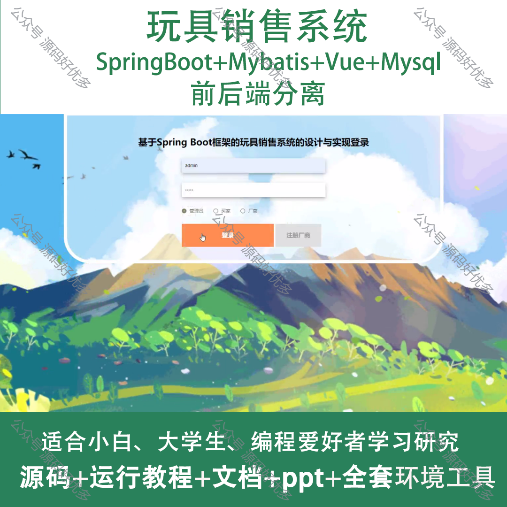
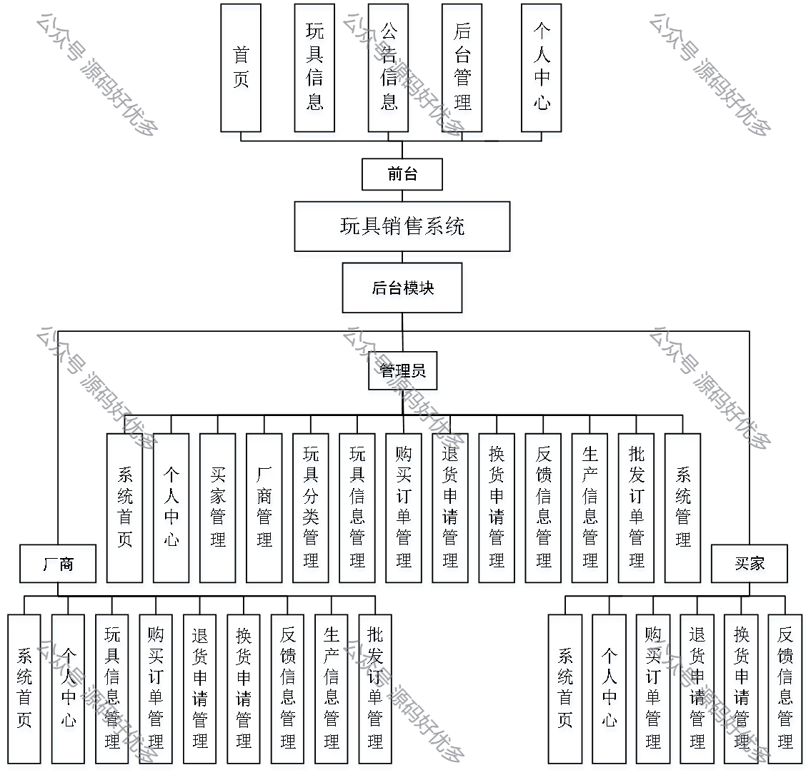
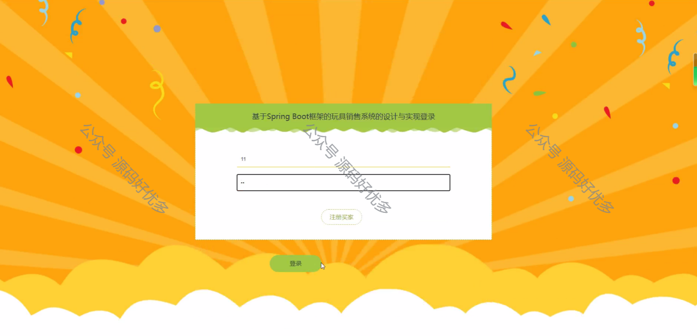
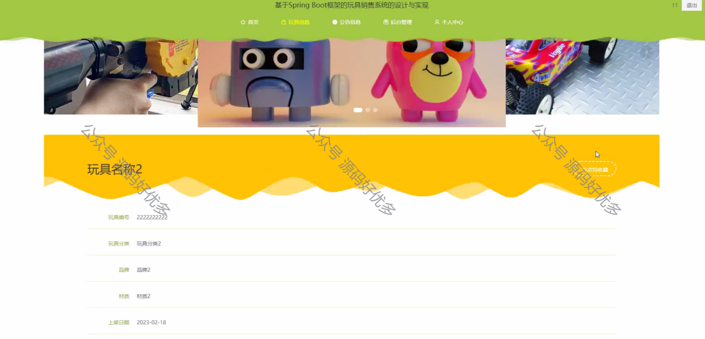
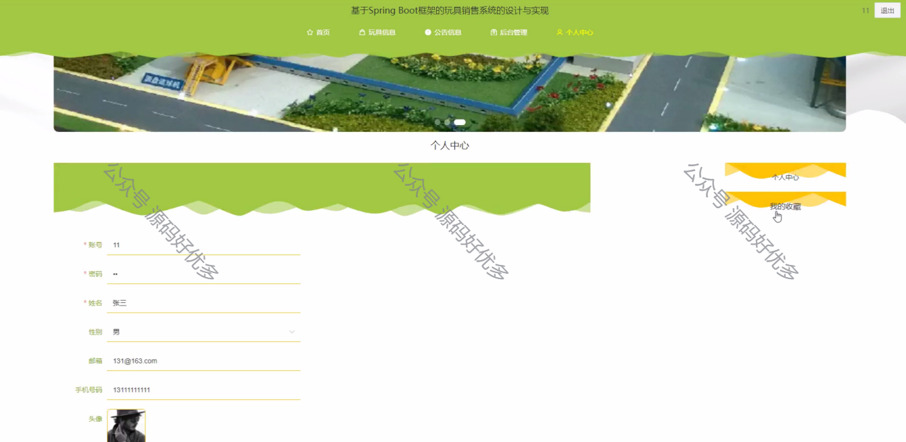
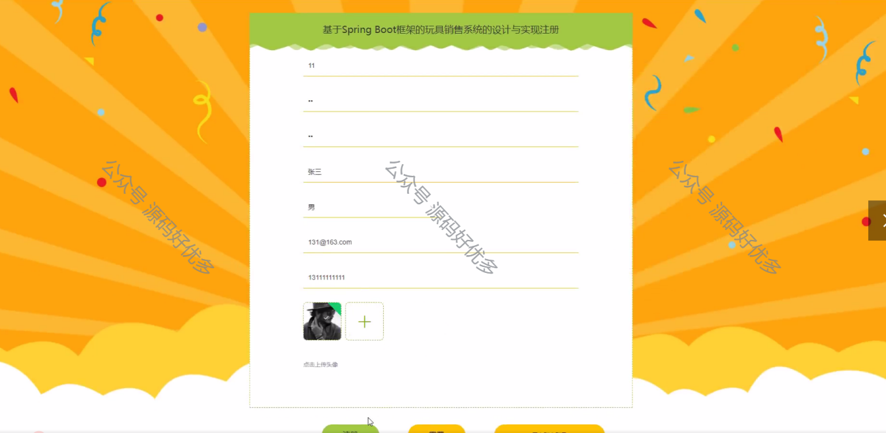
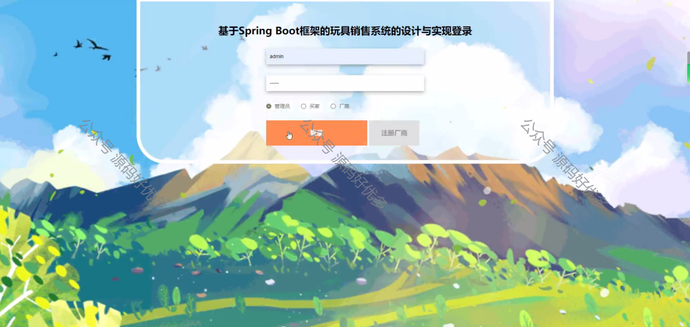
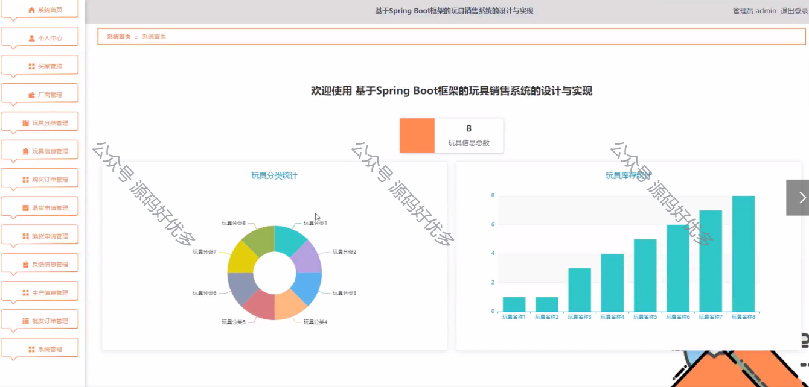
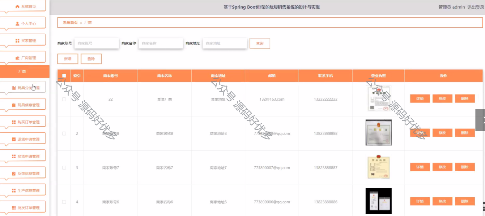
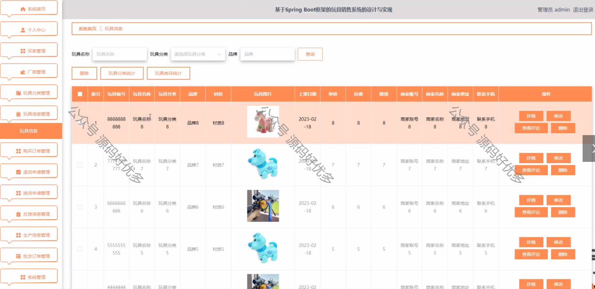
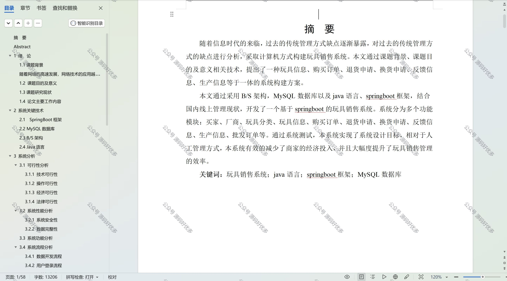

  
